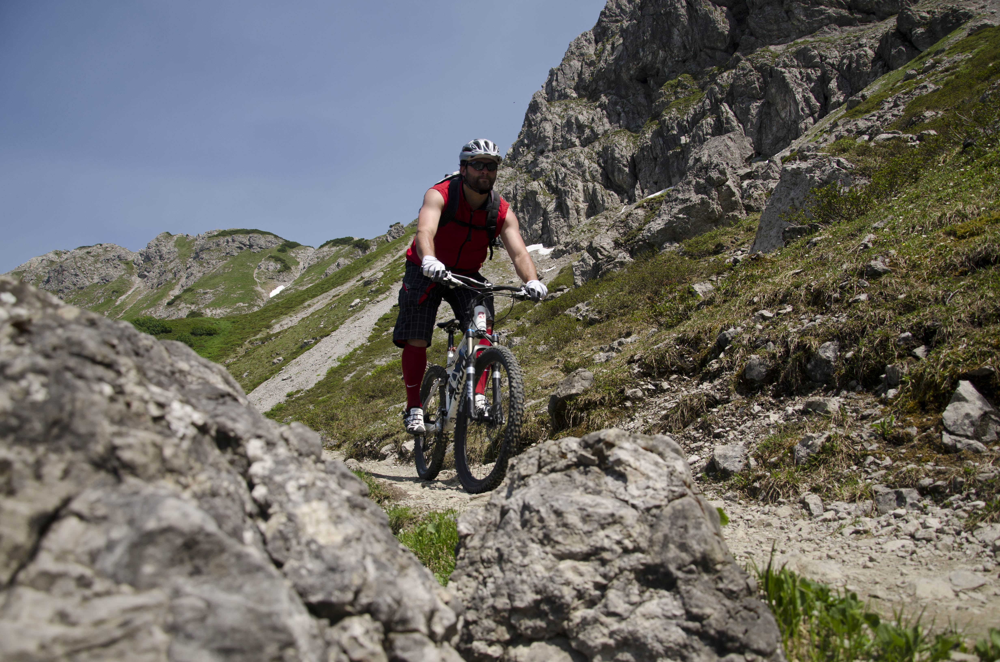

---

title: Big Mountain Riding
description: Kleinwalser Tal im Sommer
date: 2012-06-13
banner: "Kleinwalsertal06302012151343.jpeg"
tags:
  - MTB
  - Österreich
  - "2012"
  - Tobi
  - Lukas
  - Andy
  - Mark

layout: layouts/post.njk
---

The Heidelberg’s Finest riders collective teamed up with Austrian photographer Lukas Pilz for a mountainbiking trip to the beautiful trails of the Kleinwalsertal.
The beauty of this deep and narrow valley and the endless possibilities for big mountain riding inspired us for this two day trip to the northern part of the Austrian region Vorarlberg. 

# Day 1: Kanzelwand

We started day one with plenty of energy bars in our packs and  our motivation was as high as the mountains beside us when we set out for the Kanzelwand. 

The sun was melting us down during the ascend of the nearby peak of the Kuhgehrenspitze. After enjoying the silence and the alpine panorama for a while, we were pretty  excited about the following downhill in the shades of the Kanzelwand through gnarly singletrails and open cow alps.


{{ imageGrid([
 ["Kleinwalsertal06302012102356.jpeg"], ["Kleinwalsertal06302012125552.jpeg"]
]) }}

Back in our home base Riezlern, we set out one more time to meet our local guide Mario who wanted to show us a secret trail in Mutterberg. The trail was awesome but unfortunately Mario hit a wrong jump and slammed heavily so our first day ended abruptly with a bad touch and an unfinished ride.

# Day 2: Down to Baad

After stocking upwith  Schnitzel and Weißbier we planned our tour for the following day to the Walmendinger Horn with a holy trail down to Baad. 


{{ imageGrid([
 ["Kleinwalsertal07012012124314(1).jpeg"], ["Kleinwalsertal06302012102600.jpeg"]
]) }}

This tour had everything trail dreams are made of – a breathtaking panorama, a sweatdripping uphill, and a single trail with many faces: It started pretty flat and flowy on alpine terrain in the backcountry of the valley but midway it changed to a gnarly and highly technical beast  with loads of challenges for the bikes and the riders. Meanwhile the atmosphere got more and more mystically because of an uprising thunderstorm. The lower part of the trail was  fast and flowy and a perfect finish for the tour and the weekend. 

Fortunately Lukas always had his DSR on hold to capture  the great atmosphere of the trip  so we can share some of the moments which are imprinted in our memories with you…What remains, now that I’m writing this on a rainy day, is the unfed appetite for ever more riding in spectacular terrain with good company.

Go ride!