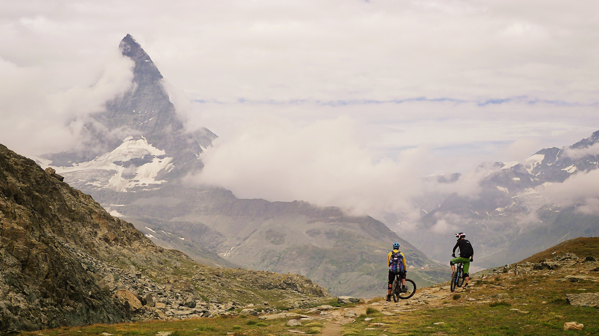
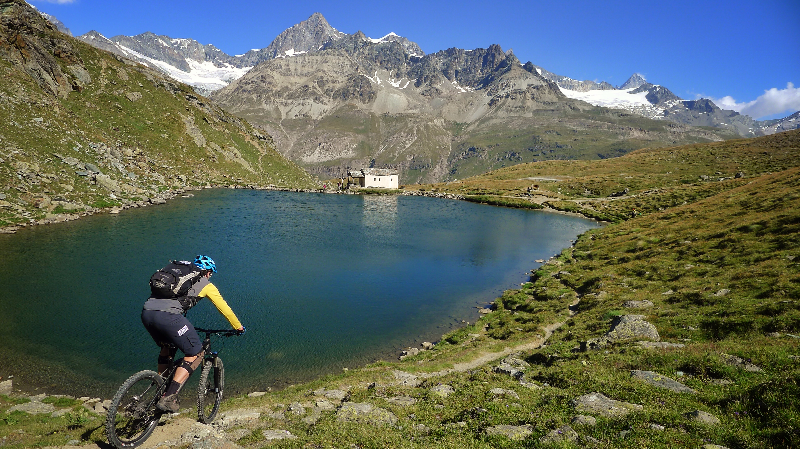
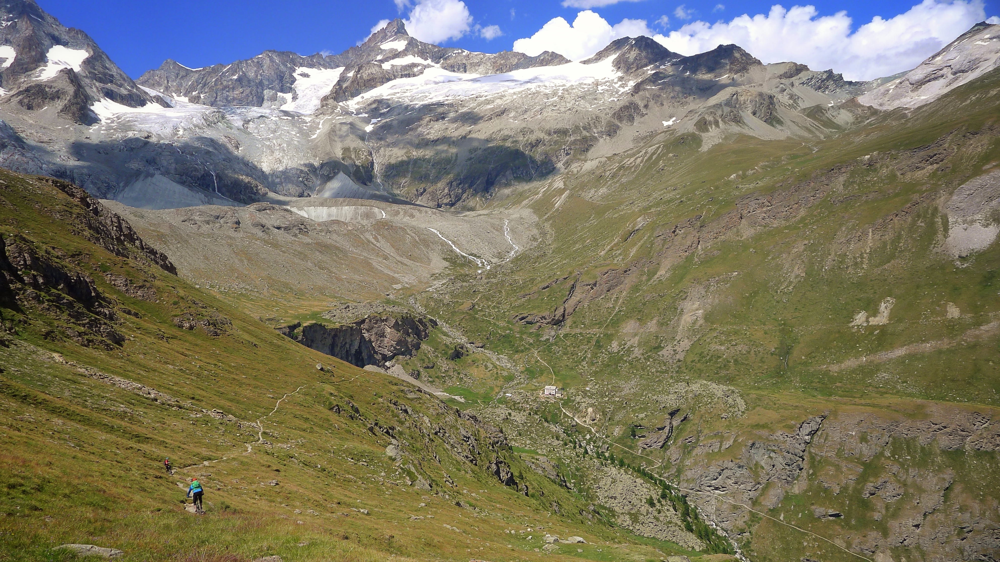
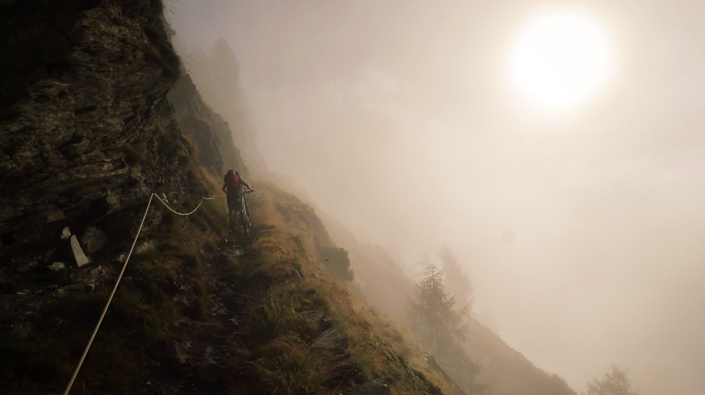
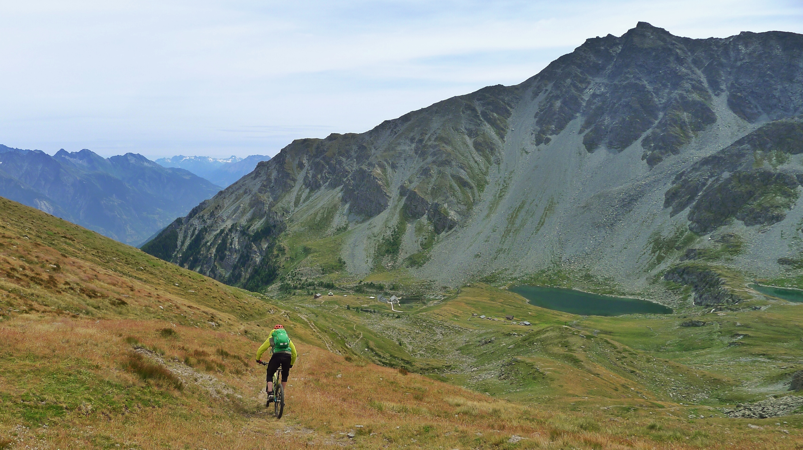

Wir haben uns die Entscheidung nicht leicht gemacht, aber Heidelberg’s Finest musste in diesem Jahr vorübergehend die Eurozone verlassen. Nachdem die Schweizer Notenbank im Januar die Kopplung des Franken an den Euro aufgibt, droht unmittelbar vor unserer Haustür eine humanitäre Krise. Unser Ansatz: Durch ein gezieltes Aufkaufen von Lifttickets im Wallis werden wir den Franken stützen und schlimmeres von den Eidgenossen abwenden.

# Tag 0
Der Hilfskonvoi ist unterwegs. Ich stehe am Geldautomat vor dem Lötschbergtunnel. Es beginnt zu regnen. Hunde und Katzen. Die Ampel springt auf Grün. Man wird ungeduldig in der Schlange vor der Autoverladung, weil die zwei Affen mit den Bikes auf dem Auto alles blockieren. Kurzer Sprint in Flip Flops und ab durch die Röhre. Auf der anderen Seite im Rhonetal ist ordentliches Wetter. Jeder wie er’s verdient! Es ist recht spät als wir in Täsch auf dem Campingplatz eintreffen. Christian und ich sichern einen Platz am Ende des Geländes. Kurz vor Einbruch der Dunkelheit treffen auch die beiden Berufsjugendlichen aus München ein. Die Schicksalsgemeinschaft ist komplett, die Zelte stehen, Ravioli werden ausnahmsweise erhitzt und das Helle schmeckt.

# Tag 1
Gegen 7 Uhr schälen wir uns aus dem Zelt, jeder erhält die tägliche Ration der insgesamt 12 kg Müsli die wir in die Schweiz eingeführt haben. Es dauert eine ganze Weile bis jeder sein Equipment beisammen hat und so sind wir erst gegen 9 Uhr auf dem Trail nach Zermatt unterwegs. Man hatte sich einstimmig gegen Einrollen auf Asphalt entschieden.

In Zermatt machen wir’s uns einfach und shutteln mit der Gornergratbahn von 1800 Meter auf 3000 Meter. Das Panorama haut uns um: Im Norden die gewaltigen Eismassen des Monte Rosa Massivs, im Westen die aberwitzige Felskonstruktion des Matterhorn. Trotzdem verweilen wir nicht allzu lange auf dem Gipfel. Die Tour soll endlich beginnen und wir wollen auch ein wenig den Touristenmassen entkommen. Der erste Teil hinunter zum Riffelberg ist verblockt aber fahrtechnisch einfach – wir fliegen auf einem breiten Rücken parallel zum Monte Rosa Massiv auf das Matterhorn zu. Unterwegs gründen vier Touristengruppen aus China spontan den ersten HDF Fanclub im Reich der Mitte.

Nach kurzer Matterpornoramapause am Riffelsee setzen wir unsere Tour Richtung Sunnega auf immer flowigeren Trails fort. Der folgende Uphill auf einem Wirtschaftsweg zum Blauherd ist gut zu meistern. Darauf folgt ein phänomenaler und nur wenig ausgesetzter Höhenweg mit einigen Ups und Downs und noch mehr Flow. 

Gezwungenermaßen tunen wir Flos Schaltwerk mit einer Feile und tauchen dann langsam unter die Waldgrenze. Das Gebastel geht los. Nach einer schier endlosen Abfahrt machen wir einen Abstecher in unsere Stammkneipe ‚Spar‘ und verarbeiten bei zwei Quöllfrisch die ersten Eindrücke vom Wallis. Viele Trails sehen aus wie Japanische Zengärten; es muss eine unglaubliche Arbeit sein, die alpinen Wege und Steige so in Stand zu halten. Abends grillt Son of Hibachi für uns. Wir haben die Latte für die kommenden Tage sehr hoch gelegt.

# Tag 2
Der Start in Tag zwei läuft effizienter ab. Wir wissen wo das Müsli steht, die Rucksäcke sind bereits gepackt und den Weg nach Zermatt absolvieren ­­­wir auf der Fahrstraße. Deshalb stehen wir gegen 10 Uhr schon am Schwarzsee – zugegebener Maßen auch dank Liftunterstützung. Von hier sind es per pedes noch zwei Stunden bis zur Hörnlihütte, wo die Normalroute zum Matterhorn beginnt und Luis Trenker vor Jahrzehnten Red Bull Media Productions gegründet hat. Auf uns wartet hier oben feinster MTB Flow auf dem Hobbittrail welcher uns direkt unterhalb der Hängegletscher der Matterhorn Nordwand ausspuckt. Ein erster härterer Aufstieg beginnt. Zuerst fahrend, dann schiebend und schließlich tragend steigen wir auf. Direkt gegenüber vom Matterhorn laden wir ein zum HDF Mittagstisch mit Trailgurke und Schweizer Käse aus unserer Stammkneipe. Danach wartet ein handtuchbreiter Höhenweg auf S0 Niveau. Wir machen die Bremsen auf und fliegen mit dem Matterhorn im Rücken das Tal hinaus und hinunter nach Trift.

Nach einer kurzen Welle wird der Trail wieder technischer und verlangt uns einiges ab, bevor wir bei Air Zermatts Heliport im Tal ankommen. Mittlerweile hat sich der Himmel verfinstert. Wir wissen, dass es heute Abend noch regnen wird. Eilig machen wir uns auf den Heimweg, denn wir müssen noch die großen Rucksäcke für die Übernachttour an Tag 3 & 4 packen. Mit dem ersten Regentropfen liegt das ganze Equipment für die nächsten Tage bereit und nebenbei hat Flo noch mit seiner Campingkugel Spaghetti Yolonaise für alle gezaubert. Die katholische Kirche ermöglicht uns dann ein Mahl im Trockenen: Wir stellen uns für das Essen in einer kleinen Kapelle am Ende des Campingplatzes unter – die anderen Gäste wünschen uns leicht mitleidig aus ihren T4 Westfalia Deluxe Unterkünften einen guten Appetit.

# Tag 3
Gegen 5.30 Uhr hört der Regen endlich auf, der Wecker klingelt um 6 Uhr. Beim Frühstück sind alle noch etwas verschlafen. Für Florian und mich ändert sich das spätestens auf dem Weg nach St. Nikolaus. Wir müssen in den sauren Apfel beißen und die Strecke pedalieren, Andy und Christian haben am vergangen Tag unseren Ballerbus am Ziel der Tour deponiert und dafür haben sie jetzt das Privileg mit dem Auto zur Jungenbahn zu fahren. Die Bergfahrt allein ist schon spannend. Die Bikes werden außen an der Viererkabine verschnürt, dann klettert die Bahn teilweise fast senkrecht hinauf nach Jungu. Kurz nach acht Uhr beginnen wir von dort den Aufstieg zum Augstbordpass. Die Stimmung an diesem Morgen ist eigen. Immer wieder verschwinden wir in dichtem Nebel um kurz darauf einen Ausblick auf strahlend blauen Himmel und die umliegenden Gipfel zu erhaschen. Wir steigen eine ganze Weile entlang einer ausgesetzten, drahtseilgesicherten Passage auf, bevor sich das Tal verbreitert.

Vier Stunden mühen wir uns in absoluter Abgeschiedenheit bis zum Pass auf 2893 Metern. Wir kommen kurzfristig ab vom Weg und selbst eingefleischte Freunde von Kompass und Karte lernen Christians GPS zu schätzen. Die Abfahrt ist anstrengend. Grobes Geläuf fordert ständige Konzentration und die ersten Snakebites zwingen uns zu Zwangspausen. Unter dem Monstergeballer beginnt Christians Dämpfer Luft zu verlieren und er muss die Tour abbrechen. Zum Glück kann er ab Gruben auf einer Fahrstraße abfahren. Der Rest macht sich auf den Weg zum Meidpass. Die ersten 500 Höhenmeter sind eine willkommene Abwechslung, da man doch tatsächlich fahren kann. Aber ab dem Fatamorgana Tippi sind wir wieder in unserem Element: Von hier an dürfen wir die Bikes endlich erneut schultern. Die körperliche Belastung ist extrem aber nach knapp drei Stunden ist der Übergang ins Val d’Annivers geschafft. Die Abfahrt zur Hütte ist durchwachsen. Unendlich lange queren wir den Hang und vieles bleibt unfahrbar. Gegen 19.30 Uhr erreichen wir endlich die Cabane Bela Tola. Das diskutierte Worst Case Szenario tritt nicht ein: Wir müssen weder hungrig noch durstig ins Bett.

# Tag 4
Am Morgen verschwindet Andys Druckpunkt an der Hinterradbremse gemeinsam mit dem Mond. Shit. Die Gruppe wird weiter dezimiert. Nur Florian und ich können den Lohn der Plackerei am Vortrag einstreichen. Nach einem kurzen Aufstieg zum Pas de l’Illsee warten über 2000 Höhenmeter Abfahrt auf uns: Ein klassischer Deluxe Alpentrail mit technisch verblocktem Geläuf oben und immer flowiger werdenden Passagen nach den Meterschialpen.

 In Agarn treffen wir uns alle wieder. Das Mittagessen steigt in der Pizzaria mit dem schlechtesten Preisleistungsverhältnis zwischen Tromsö und Palermo – und dabei hat es nicht mal schlecht geschmeckt. Immerhin gibt es eine gute Nachricht: Christian konnte doch tatsächlich mit Telefonsupport aus der Heimat seinen Dämpfer im Alleingang warten. Und das Ding hält die Luft. Andys Bremse ist da schon eher ein Problem. Es ist Sonntag. Kein Bikeshop in Sicht geschweige denn geöffnet. Wir klappern Tankstellen ab in der Hoffnung irgendwie an Hydrauliköl zu kommen – das Werkzeug zum Entlüften haben wir dabei. British Petrol ist die Rettung. Auf dem Campingplatz in Salgesch machen wir den Hobel wieder fit und stärken uns für das morgige Highlight. Als wir uns in die Zelte begeben beginnt es heftig zu regnen – dabei war doch eigentlich Le Pano Bleu für morgen angesagt…

# Tag 5
Bergfex lügt nicht. Als ich den Reisverschluss des Zelts öffne ist keine Wolke am Himmel. Leicht angewidert werfen wir die letzte Ration Müsli in die Schüssel und dann nichts wie ab zur Zahnradbahn nach Crans Montana: Immer der roten Linie folgen! Weiter geht’s mit der Seilbahn hinauf zur Plaine Morte. Auf 3000 Meter liegt der Gletscher in Mitten einer atemberaubenden Mondlandschaft. Leider ist es für eine ausgedehnte Pause, um das ganze Panorama einzusaugen, zu kalt. Starker Wind drängt zum Aufbruch. Über griffige Schutthalden fahren wir kurz ab und beginnen den Aufstieg zur Wildstrubelhütte über Schneefelder. Dort wartet eine Abfahrt mit einigen Herausforderungen. 

Wir fahren ab wie im Rausch und meistern im Flow mehrere Schlüsselstellen. Langsam wird die Landschaft lieblicher. Nach dem Rawilpass fahren wir über saftige Wiesen bevor der Trail zum Lac de Tseuzier wieder steiler wird. Einige Höhenmeter werden auf einer Schotterpiste vernichtet, um dann auf einem extrem ausgesetzten Abschnitt hoch über der Talsohle zu landen.

Wir schieben, Trailrunner überholen, unser Puls schnellt trotzdem in die Höhe, es wird nur wenig gesprochen. Danach verschwinden wir für einige Zeit im Wald auf flowigen und weichen Wegen die schließlich entlang der Suone ins Rhonetal führen. Alle sind happy. Die heutige Tour hat uns vom Gletscher über hochalpine Trails hinunter zu Wald und Weinbergen geführt. Wir sind dankbar, dass wir diese Tour zum Abschluss gemeinsam erleben durften. Vor 24 Stunden war wegen der Defekte davon nicht auszugehen. Wir haben noch ein paar Körner in den Beinen und vernichten die letzten Kilometer zurück zum Ausgangspunkt mit mächtig Druck auf den Pedalen. Und so stehen wir pünktlich um halb fünf auf dem Heimweg im Feierabendstau im Wallis. Wir hätten noch ein paar Tage länger bleiben sollen.