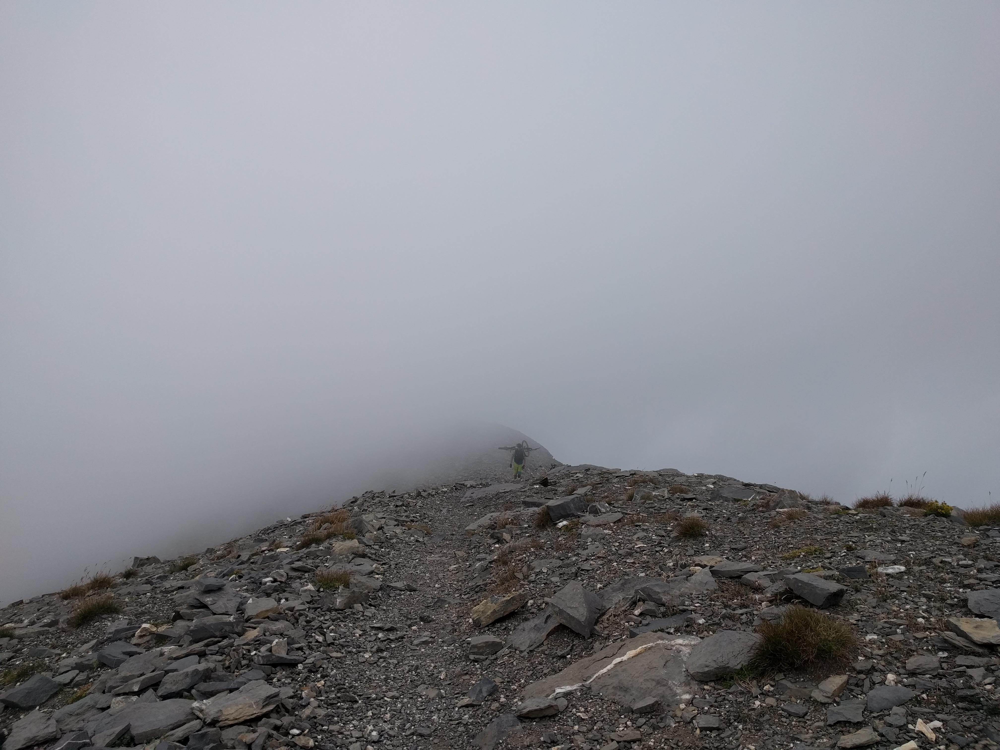

  
# Endlich wieder in die neue Heimat

Rolands Hütte stellt sogar für mich schon eine Art Heimat und Sehnsuchtsort dar. Unser erster Bikeausflug in die Alpen auf Starrbikes und seitdem immer wieder zum Biken oder einfach zum Urlaub machen, aber immer natürlich zum Käse essen.

Dieses Mal gab es eine Premiere. Familienzusammenführung - Marks Familie, meine Familie (damals noch zu dritt), Familien und Bikes. Ein Experiment für die Zukunft quasi. Es war also klar, das wir Kompromisse eingehen müssen - nicht nur bei der Essensplanung, sondern auch beim Stakeholdermanagement. Schon im Vorfeld wurde ausgehandelt, ob nicht eher die aufgemotzten Nähmaschinen anstelle unsere Bikes mitkommen… dieses Mal haben wir gewonnen.

Aber nicht nur die begrenzte Zeit, sondern auch das französische Wetter limitierte unsere Möglichkeiten. So mussten wir die geplanten Backwarenbewegungen leider aufgrund miserablen Wetters knicken.

Und die wenigen Sonnentage wollten wir dann natürlich auch nutzen, um mit der Familie zum Baden zu gehen. Aber ein halber Tag mit wechselhafter Prognose war dann doch drin. Die Planungen waren kurz: Mark wollte schon länger mal schauen wie es im Talschluss oben aussieht. Tete des Ottans 2480 Meter über dem Meer - zu deutsch: die Otterköpfe am Ende der Welt.

<iframe src="https://www.komoot.de/tour/42791783/embed?profile=1" width="100%" height="700" frameborder="0" scrolling="no"></iframe>

Hier hatten wir bei unserem ersten Biketrip vor über 20 Jahren kehrt gemacht. Das Ende der Welt - le Bout du Monde - war damals das Ende einer Tour. Dieses Mal wollten wir hier auf jeden Fall weiterkommen. Vorbei am [Refuge de la Vogealle](https://refugedelavogealle.com/), wo es bei herrlichem Sonnenschein noch einen Kaffee und einen Tee gab. Die Laune war blendend, bis hier lief es gut. Ab jetzt betraten wir Neuland und konnten den weiteren Aufstieg zu den Otterköpfen. Wir passierten einen herrlichen Bergsee bevor wir eine fettige Steilstufe überschreiten mussten. Enge Serpentinen und ordentlich vom Regen aufgeschwemmt - das könnte in der Abfahrt witzig werden. Danach wurde der Boden steiniger und die Aussicht offener. Was auch das aufkommende Unwetter offenbarte. Hm, was tun? Wir waren vermutlich auf 2000 Metern, das schönste Stück lag noch vor uns. Der Gipfel war schon in Sicht. Ich konnte mich durchsetzen und wir gingen weiter. Mittlerweile die Räder auf dem Rücken Richtung Gipfelaufbau. Ein herrlicher Grat aus Schiefer. Gestern träumten wir uns schon während der Planung in die Abfahrt dessen… das wir hier Unwetter haben, kam in unserem Träumen nicht vor. Aber gut. Die gut gelaunte Wandergruppe kam auch nicht vor. Die gute Laune des Bergführers bezüglich unseres Vorhabens bestärkte uns aber darin weiter zu gehen. Allerdings kamen auch jetzt die Wolken und hüllten uns in eine Sicht, die nicht weiter als 20 Meter reichte und vor allem starken Platzregen brachte. Wir erhöhten unser Tempo und kamen am Gipfel an. Aussicht: Fehlanzeige.

 Immerhin, dank des steinigen Untergrunds sollte der Regen keine übermäßigen Probleme darstellen. Wir legten die Schoner an, schoben einen Riegel in den Mund und machten uns auf den Weg. Keine Probleme! Wir kamen gut voran und die Abfahrt war spaßig. Wir hatten die Wandergruppe schnell wieder eingeholt. Mittlerweile in Regenponchos gehüllt. Laune immer noch blendend. Bei uns auch. Es zeichnete sich ab, dass wir durchs Gröbste durch waren. Der Regen ließ nach. Wobei die fettige Steilstufe durch den Regen nicht angenehmer wurde - wir mussten immer wieder schieben, da es einfach zu steil und rutschig war. Aber ab dem Refuge kam die Sonne wieder durch die Wolken und wir hatten einen Mordspaß in der technischen Abfahrt. Auch der ältere Herr mit dem Regenschirm und dem Baguettes im Rucksack war bestens gelaunt - nur war er der Meinung, dass wir ganz schön langsam unterwegs sind… was weiß der schon!? Die Abfahrt über das Talende und das Reserve Naturelle war dann der reine Genuss und mit bester Laune kamen wir zurück zur Familie. Kurz und intensiv, aber auf jeden Fall eine herrliche Biketour. Familie Bangert musste dann leider die nächsten Tage die Heimreise antreten und ich konnte mein Tourenbuch noch mit einem Earlybird zum altbekannten Refuge de Grenarion füllen, was mir auch nochmal einen tollen Morgen auf dem Bike bescherte. Die neue Heimat liefert einfach jedes Mal aufs Neue. Was für ein wunderbarer Ort. Danke Roland!