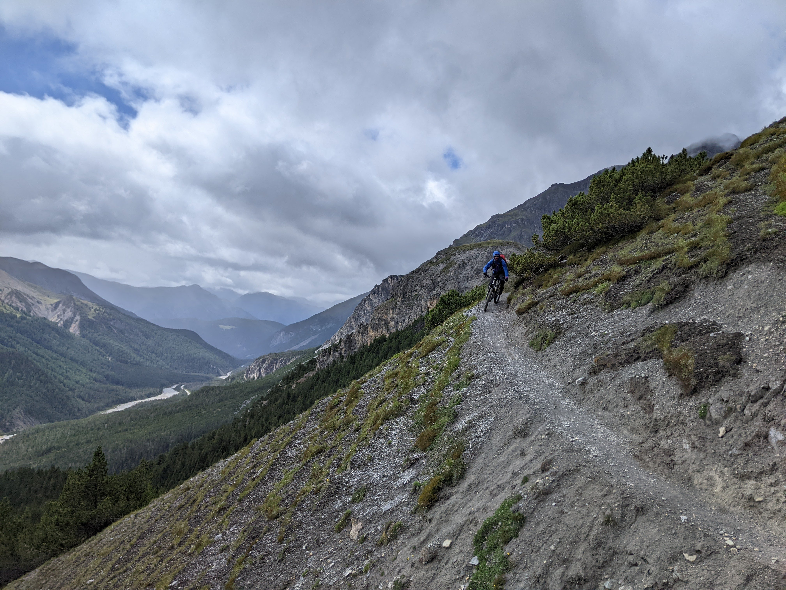
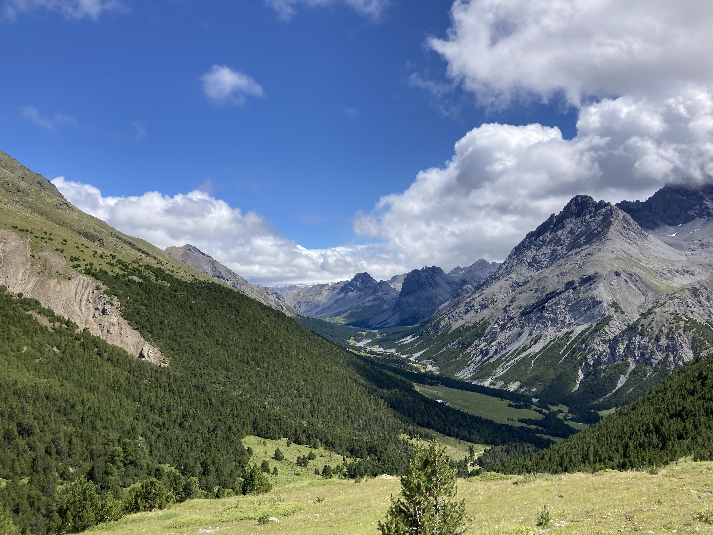

# Vorgeplänkel

Die Wetterprognose sagt Schnee. Schnee! Im Sommer! Schon fucking wieder! Kann ja wohl nicht wahr sein, dass wir die Sinnhaftigkeitsdiskussion jedes Jahr aufs Neue führen müssen! Wohl schon! Ganz Europa droht nach den Hundstagen ein Temperatursturz. Um das ganze abzukürzen: Alternativziel? Absagen? Durchziehen? Verschieben? Wir entschieden uns zu pokern und eventuell um ein paar Tage nach hinten zu schieben. 

Umso näher unser Stichtag rückt, umso wahrscheinlicher wird, dass unsere Taktik tatsächlich aufgehen könnte. Auch wenn um uns herum die Meldungen bezüglich Neuschneemengen in den Alpen erschreckend sind. Die Vorfreude nimmt zu, aber die Anspannung hält sich. Mal wieder planen wir einige Tage über 3000 Meter im hochalpinen Gelände unterwegs zu sein. Da kann der Faktor Schnee schon ein unangenehmer Showstopper sein. Aber gut. Wir entscheiden uns, von Tag zu Tag zu planen. Der erste Tag ist ein guter Einstieg, da wir weder zu hoch sind noch durch gefährdetes Gelände kommen. 
   

# Tag 1. Klosters - Santa Maria
 

<iframe src="https://www.komoot.de/tour/1245359202/embed?profile=1&share_token=a7oNYNvbcR0XkYkfoKq6NJYZ4201CLUFkOrLUfOVFauV87sGpb" width="100%" height="700" frameborder="0" scrolling="no"></iframe>
 

Wir treffen uns in Klosters am Bahnhof bei strömendem Regen. Die Fahrt war von anhaltendem Starkregen gezeichnet und einem Bauern, der mich mit einem Stein bewirft, nur weil ich mal pieseln muss.

Wir packen unsere Rucksäcke, während die Rhätische Eisenbahn abfährt. Egal, wir haben ausreichend Zeit und die Hoffnung im Verlauf des Tages könnte der Regen nachlassen. Während wir am Bahnsteig warten, bietet uns die Schweizer Bahn ein Spektakel mit einer historischen Dampflok. Die Schweiz liefert auch in Wartepausen. Als wir aus dem Tunnel bei Lavin kamen, klart das Wetter auf. Der Regen endet, während wir aus dem Zug steigen und uns gemächlich auf die Bikes schwingen, um den Aufstieg von Scuol Richtung Val Müstair durch das Val Bella auf den Spuren von Leo Kast in Angriff zu nehmen. Die Jacken wandern schnell in den Rucksack und wir treten gut gelaunt die entspannt ansteigende Schotterstraße hinauf. Nach 45 Minuten klingelt zum ersten Mal der Fresstimer und wir werfen Futter ein. Da wir beide gerade in der Vorbereitung für lange Trailläufe sind, wollten wir die Taktik der regelmäßigen Energiezufuhr mal testen.
   

   
Am Dach der Tour auf 2530 Metern schlägt das Wetter dann doch nochmal um. Nach kurzem Zögern entschließen wir uns dann doch die Regenklamotten anzuziehen. Diese Entscheidung erweist sich als richtig, denn ein kurzer, aber intensiver Schauer wäscht uns einmal kurz durch. Die Abfahrt heißt uns mit traumhaften Aussichten und unwirklichen Landschaften direkt im Alpenhauptkamm willkommen. 

   

   

Der Trail erfordert Aufmerksamkeit, aber ohne uns zu sehr zu kitzeln und so freuen wir uns über diese erste schöne Abfahrt. Das Wolkenspiel bietet das perfekte Ambiente. Als erneut der Fresstimer klingelt, nutzen wir die Gelegenheit, um die Regenklamotten für heute abzulegen. Den Rest des Tages fahren wir bei trockenen und angenehmen Bedingungen bis zu unserem Tagesziel Santa Maria auf einem schier endlosen und abwechslungsreichen Waldtrail. 

 
 


{{ imageGrid([
 ["Schweiz_20230805205818.jpeg"], ["Schweiz_20230806083336.jpeg"]
]) }}

   

Auch unsere Unterkunft ist ein Treffer - nicht nur dass uns die Chefin schönes Wetter garantiert hat, auch die Zimmer sowie die Speisekarte erfreuen uns sehr und so genießen wir den Abend bei Bündner Spezialitäten im Garten. Danach machen wir noch einen kurzen Spaziergang zum Bankomat und schauen schon mal, wo am nächsten Tag der Postbus startet. Die kleinste Whiskybar der Welt lassen wir dabei aus. Vielleicht beim nächsten Mal.
   

# Tag 2: Santa Maria - Piz Umbrail - Val Mora - Livigno
 

<iframe src="https://www.komoot.de/tour/1247004673/embed?profile=1&share_token=aI7025HV7rTvJJjPxDAtTp2FOgfTxYTwqxsO9upmqwgr7UJprv" width="100%" height="700" frameborder="0" scrolling="no"></iframe>
 

In Claudines Bar bekommen wir ein erstklassiges Frühstück. So macht das Freude. Wir lassen es entspannt angehen und nehmen den Postbus hoch zum Umbrailpass auf 2500m. Hier beginnt unsere heutige Tour. Die folgenden 500 Höhenmeter sind vor allem mit dem Rad auf dem Rücken zu bewältigen. Wir sind nicht alleine und treffen kurz unterhalb des Gipfels auf andere Bikerinnern und Biker. 

   


{{ imageGrid([
 ["Schweiz_20230806092252.jpeg"], ["Schweiz_20230806111050.jpeg"]
]) }}


{{ imageGrid([
 ["Schweiz_20230806105609.jpeg"], ["Schweiz_20230806125016.jpeg"]
]) }}

   

Wir sind dann aber doch etwas zügiger und nachdem wir uns ausgiebig umgeschaut haben, schnallen wir die Schoner an und machen uns auf den Downhill. Kaum sind die ersten paar hundert Tiefenmeter hinter uns, kommt eine Schlechtwetterfront auf uns zu gerollt. Wir werfen uns sofort wieder in angemessene Kleidung und fahren kurz darauf durch den Regen, der sich immer wieder in Schnee verwandelt. 

   

   

Die Landschaft ist ziemlich cool, die Finger cooler und der Trail am coolsten. Sehr abwechslungsreich geht es vom Gipfel des Piz Umbrail auf 3020 m hinunter Richtung Val di Mora, vorbei an traumhaften Bergseen und Wasserfällen. Und noch während wir im Umbrailtrail sind, schlägt das Wetter pünktlich zur nächsten Fresspause wieder um in Richtung Frühling. Und so nutzen wir die Gunst der Stunde, ziehen uns mal wieder um und machen eine etwas ausgedehnte Pause direkt neben einem rauschenden Bach. Langsam ahnen wir, dass wir uns die nächsten Tage häufiger umziehen werden als JLo bei den Oscars. Wir gönnen uns die letzten Trailmeter um dann die Gravelroad ins Val do Mora zu nehmen. Wir sinnieren etwas über die Gravelkategorie (https://theunpavedhub.com/resources/industry-standard-guide-to-gravel/) und sind letztendlich froh, dass es uns eigentlich recht egal ist. Hier pfeift‘s jedenfalls aus allen Ecken! Die Murmeltiere, die Ebiker und vor allem der Wind. Die Wolken ziehen schneller als Lucky Luke und regelmäßig geben sich die Jahreszeiten die Klinke in die Hand. Aber pünktlich zu Fress o‘clock erwischen wir ein Sonnenfenster als wir an der Alpe Mora sind.

   

   

Hier haben wir die Möglichkeit unsere heutige Etappe abzukürzen. Am Arsch! Ist ja Sommer und wir haben eh nichts besseres zu tun. Einige Gabeln voll Kuchen, Löffel voll Gerstensuppe und Instagrampics später machen wir uns auf in den nächsten Anstieg. 

   


{{ imageGrid([
 ["Schweiz_20230806140333.jpeg"], ["Schweiz_20230806140354.jpeg"]
]) }}

   

Es ist bolleheiss! Wir haben uns für einen Schlenker entschieden, der uns nach Livigno führen soll. Von der Hochebene führt ein breiter Weg über viele Kehren nach unten. Wir bügeln im Endurostyle nach unten, während der Trail enger und wurzeliger wird. Irgendwann spuckt er uns etwas oberhalb des nordöstlichen Ufers vom Lago di Livigno aus. Das Wasser funkelt grünblau im Schein der Nachmittagssonne als wir am See entlang traversieren. Und schon wieder ist es Zeit für einen Snack! So langsam finden wir Gefallen an diesem Ritual. Kurz darauf ist es Zeit für einen Stilwechsel: In dieser Gegend trägt der Ballerboy von Welt Regenkluft! Zumindest die nächsten 45 Minuten. Dann gibts Riegel und Kurz????????. Die Sonne scheint und wir steigen in den letzten Climb des Tages. Etwas überraschend steil und mit dem Rad auf dem Rücken - dafür aber endlich mal mit Regenbogen. 

   


{{ imageGrid([
 ["Schweiz_20230806171017.jpeg"], ["Schweiz_20230806173420.jpeg"]
]) }}


{{ imageGrid([
 ["Schweiz_20230806181408.jpeg"], ["Schweiz_20230806190547.jpeg"]
]) }}

   

Auf der anderen Seite wartet dann noch ein feiner und verspielter Downhill auf uns, der uns bis ans westliche Ufer des Lago di Livigno bringt. Von hier aus sind es noch ein paar Kilometer durchs Tal, einmal quer durch Livigno City und kurz dahinter liegt unsere Unterkunft. Wir beschließen, uns zur Feier des Tages nochmal umzukleiden - es schifft jetzt wie aus Kübeln. Im Städtchen scheint gerade Kerwe zu sein und so fahren wir in Schlangenlinien durch die Menschenmenge und Attraktionen zu angemessener Italodancemusik. Die Regenkapuzen hängen tief - gut, dass wir passend gekleidet sind. An unserem Hotel gibt’s erstmal eine Dusche. Zuerst für die Bikes, dann sind wir dran. Danach ab zu Pasta, Pizza und Debatten über’s Wetter. Draußen wird Regen zu Schnee…
   

# Tag 3: Livigno - Piz La Stretta - Chamana Georgy
 

<iframe src="https://www.komoot.de/tour/1249286688/embed?profile=1&share_token=aY7tJEIu6fqt7P3r2JrSg7JMWjDhao9U5dKzRw1RYFaPJquleR" width="100%" height="700" frameborder="0" scrolling="no"></iframe>
 

Es gibt italienisches Frühstück. Ich pfeife mir direkt 3 Stück Kuchen rein. Genial! Auch abgesehen vom Kuchen lässt das Frühstück keine Wünsche offen. Mit dem Wetter schaut es anders aus. Es schneit immer noch leicht. Na toll. Die nahegelegenen Gipfel haben einen Zuckerguss. Eigentlich haben wir heute wieder zwei Stellen über 3000 m auf dem Trailbook: Den Piz La Stretta, die Übergänge der Ochsentour und natürlich als Tagesziel unseren Sehnsuchtsort, die Chamana Georgy. Die Diskussionen vom Abendessen gehen nahtlos weiter. Die Ochsentour wurde eigentlich schon ausgeschlossen - zu viele unbekannte Teile und zu viele Höhenmeter für die Wettersituation - kein Grund, nicht nochmal in aller Breite über diese Option zu reden. 4 Tassen Kaffee und zahlreiche von allen Seiten beleuchtete Argumente später fahren wir los bei Sonnenschein. 

   


{{ imageGrid([
 ["Schweiz_20230807073211.jpeg"], ["Schweiz_20230807113759.jpeg"]
]) }}

   

Bei anhaltendem Schneegestöber steigen wir dann auf zum Lach dal Mónt. Anfänglich war die Strecke gut fahrbar, mittlerweile sind wir wieder zu Fuß unterwegs. Die umliegenden Gipfel sind schneebedeckt. Wir sind uneinig, was die Einschätzung der Schneedecke angeht. Ich bin guter Dinge, dass der Schnee weitestgehend geschmolzen ist, bis wir in die entscheidende Höhe kommen - Mark hat Bedenken. Gut, dass wir erstmal was Futtern dürfen. Der Zuckerschub gibt Zuversicht und wir nehmen den Gipfelsturm in Angriff. Meine Prognose sollte sich bewahrheiten und der Trail ist gut laufbar. Kurz unterhalb des Gipfels bekommen wir Props von einer Gruppe Wanderer. Danach haben wir den Gipfel für uns alleine. Panoramo Bernina Fantastico. (https://www.youtube.com/watch?v=UKeZWlgfhIU) Not so much heute. Die Wolken drücken leider etwas die Sicht und von Nordwesten spielt sich auch schon wieder eine Unwetterfront ziemlich auf. 

   


{{ imageGrid([
 ["Schweiz_20230807142118.jpeg"], ["Schweiz_20230807131448.jpeg"]
]) }}

   

Aber wenn wir ehrlich sind, haben wir mittlerweile etwas Respekt vor dem Schweizer Wetter verloren. Man spricht von klimatologischem Säbelrasseln - wenn auch noch hinter verdeckter Hand. Aber bisher war die Wettersituation absolut im Rahmen und hat bisher noch keine Kraft gehabt uns wirklich die Stimmung zu vermiesen. Wir sind froh, an unserem Plan festgehalten zu haben. Unbeeindruckt, aber doch zielstrebig machen wir uns an die Abfahrt. Prädikat: Sehr cool. Macht richtig Bock. Technisch, teilweise weglos auf Karst und dann auf losem Gestein und engen, ausgesetzten Kehren. Es geht einiges und wir kommen mit einem breiten Grinsen am Sattel zum Val Minor an. Jetzt heißt es, bei stark pfeifendem Wind und aufkommendem Schnee ein paar Meter abwärts Richtung Diavolezza Bergbahn zu machen - hier kamen wir auch schon vor 2 Jahren vorbei. Damals hatten wir einiges an Schnee um die Coaz Hütte ein Tal weiter. Die Georgy Hütte haben wir damals aufgrund des Schnees sein lassen. Heute wird uns das nicht passieren - die Erfahrungen am Gipfel des Piz la Streta lassen uns zuversichtlich sein. Nach einer kurzen Fresseinlage machen wir uns in den Aufstieg. Hier wird wieder getragen - vermutlich die nächsten 700 Höhenmeter bis zum Hochplateau. Es schneit und die Sonne scheint. Beides gleichzeitig. Verrückt. Aber wir sind uns einig, dass uns der Schnee lieber ist als Regen, denn eigentlich bleiben wir den ganzen Tag über trocken. 

   


{{ imageGrid([
 ["Schweiz_20230807151017.jpeg"], ["Schweiz_20230807153546.jpeg"]
]) }}


{{ imageGrid([
 ["Schweiz_20230807153806.jpeg"], ["Schweiz_20230807170740.jpeg"]
]) }}

   

Die Kälte ist dank der Steilheit des Aufstieges auch gut auszuhalten. In dieser Sektion treffen wir tatsächlich mal ein paar Leute: Ein Trailrunner (verrückt! Wer macht denn so nen Quatsch! Hier ohne Rad auf dem Rücken hochzufahren macht ja überhaupt keinen Sinn!), eine Familie mit einem jungen Mädchen und ein Pärchen. Eine Herde Steinböcke würde unterhalb des Piz Languard den Trail blockieren und ein ziemliches Spektakel aufführen. Das motiviert uns. Murmeltiere haben wir mittlerweile schon viele gesehen, aber Steinböcke bisher noch nicht. Zum Abschluss der Steilstufe meistern wir eine kurze spannendere seilversicherte Sektion. Dann wechselt die Topographie und wir betreten eine traumhafte Mondlandschaft. Alles sehr trocken - Wir freuen uns doch einen kleinen Bachlauf zu finden, an dem wir noch vor dem Aufstieg zur Hütte die Flaschen auffüllen können, da es auf der Hütte kein fließendes Wasser gibt. Aktuell ist es niederschlagsfrei und man könnte fast von gutem Wetter reden. Entsprechend gut gelaunt machen wir uns auf das letzte Steilstück zur Hütte und wir können schon bald die Steinböcke sehen, die tatsächlich mitten auf dem Trail stehen und überraschend unbeeindruckt von uns sind. Wir kommen ziemlich nah ran, bevor sich die Herde dann doch in Gang setzt und uns mal ganz nebenbei zeigt, wie der Ibex sich im hochalpinen Gelände bewegt. Beflügelt nach dieser Begegnung bewegen wir uns zügig zum Bikedepot - die letzten paar Höhenmeter sind wir mit leichtem Gepäck unterwegs und so dauert es nicht lange, bis wir tatsächlich endlich bei der Hütte sind. Nur noch ein paar spröde Schneereste sind hier und da zu sehen, haben aber keinen Einfluss auf die Wegbeschaffenheit. 

   

   

Außer uns sind nur noch drei weitere Gäste auf der Hütte. Der Schweizer mit seinen beiden jungen Töchtern sitzt schon im Aufenthaltsraum und wärmt sich am Gasofen auf - es ist zapfig! Wir ziehen uns alles an, was wir dabei haben und begießen unsere Ankunft mit einer zünftigen Kanne Kräutertee. Rock’n’Roll! Die Hüttenwirte sind jung und entpuppen sich auch als Biker. Sofort tauschen wir unsere Pläne aus. Am Funkeln in den Augen des Wirtes lässt sich erkennen, dass er ganz angetan ist. Nach dem Essen schauen wir noch die 70 Höhenmeter weiter hoch zum Gipfel des Piz Languards in der Hoffnung, einen Blick auf den Sonnenuntergang werfen zu können. 

   


{{ imageGrid([
 ["Schweiz_20230807174253.jpeg"], ["Schweiz_20230808065658.jpeg"]
]) }}


{{ imageGrid([
 ["Schweiz_20230807214454.jpeg"], ["Schweiz_20230807214815.jpeg"]
]) }}

   

Als wir oben ankommen, drehen die drei Schweizer schon Runden ums Gipfelkreuz, um warm zu bleiben. Später haben wir den Gipfel noch etwas für uns alleine und wir saugen die Stimmung auf, bevor wir uns im Dämmerlicht wieder zurück zur Hütte bewegen. Es gibt noch etwas Altherrenstretching vor der Hütte und Körperpflege. Dann machen wir uns bereits gemächlich auf den Weg ins Lager - viele Alternativen haben wir bei spärlichem Kerzenschein im Aufenthaltsraum eh nicht. Wir wünschen uns eine gute Nacht auf 3100 Meter und verziehen uns unter die Decken.
 

# Tag 4: Chamana Georgy - Val Champagna - Bikeshop - Chamana Grialetsch
 

<iframe src="https://www.komoot.de/tour/1250899004/embed?profile=1&share_token=ageWA8vpCoFpla5aWQgdAHptoq41T0tH95HdbAtXogu3fWvTzY" width="100%" height="700" frameborder="0" scrolling="no"></iframe>
 

Puh! Die unruhige Nacht lädt die Body Battery nur mäßig! Wir besuchen erstmal Helmuts Thron und dann gibt's Frühstück mit Ausblick aufs Bernina Massiv - heute Morgen auch bei bester Sicht. Mit den Wirtsleuten besprechen wir nochmal unsere Pläne, schnorren uns ein paar Fanboy-Sticker mit dem Hüttenlogo und dann machen wir uns schon auf den Weg nach unten. Eigentlich hatten wir Flow gebucht, tatsächlich finden wir uns aber in diversen Blockfeldern wieder, die höchst anspruchsvoll zu befahren sind und jede Menge Körner kosten und den müden Geist herausfordern. Es geht isohypsig auf dem Steinbockweg das Tal raus bis wir dann am Ende wieder auf den Rücken aufsteigen, um auf der anderen Seite abzufahren. Hier haben wir dann eine richtig feine Abfahrt - für uns am Rande der Machbarkeit und immer etwas drunter. Dafür gab‘s dann auch regelmäßig nette Worte der Begeisterung von den passierenden Wanderern. Nur Liebe für die Trail-Toleranz in der Schweiz. ❤️

   


{{ imageGrid([
 ["Schweiz_20230808073647.jpeg"], ["Schweiz_20230808104925.jpeg"]
]) }}


{{ imageGrid([
 ["Schweiz_20230808111323.jpeg"], ["Schweiz_20230808100544.jpeg"]
]) }}

   

Irgendwie haben wir uns in der Euphorie etwas verfranzt und kommen etwas weiter unten im
Tal an als geplant. Egal der Tag ist jung, die Sonne scheint - heute sogar schon 2 Stunden am Stück und Mark hat Bock sein Bike zu tragen. Seine Uhr findet das allerdings unterfordernd. Wir flexen vorbei am Lac de Muragle und über den Sattel ins Val Champagne. Zapf! Zapf! Wir stoßen mit Gel in Tüten an und stürzen uns in die Abfahrt. 

   

   

Erst weglos und verhagelt - später flowig und steil. Jedenfalls zu viel für meine Bremsen. Die gehen baden im Tal und quittieren ihren Dienst. Endlich wieder Bikeshop-Action - am schönsten zu genießen mit einem neuen Bike! Danke Glen! Die Schweiz raubt mir zwar den letzten Cent für die Reparatur und beschimpft mich vorher noch, dafür versorgt sie uns mit Strom und WLAN. Die ganze Scheisse ist kurz davor, den Trip zu vermiesen, aber letztendlich lässt sich dann doch alles mit etwas Geduld und Geld lösen. Der extra Stop kostet uns wertvolle Zeit, die wir dank der kleinen Roten wieder etwas aufholen. Trotzdem sind wir spät dran und geben dem Wirt der Grialetsch Hütte kurz Bescheid, dass er uns doch bitte etwas Essen aufheben möge und dann gehen wir‘s an! 900 Höhenmeter über den Scaletta-Pass warten noch auf uns. Und danach noch am Dürrboden vorbei und eine weitere 250hm Tragepassage zur Hütte hoch. Und dann Weißbier! Schlussendlich geht das aber doch besser von der Hand als angenommen. Bis auf 2300m ist alles gut zu treten, und wir genießen die Einsamkeit im Aufstieg. 

   

   

Komplett entspannt sind wir aber auch nicht mehr, vor allen Dingen wegen der fortgeschrittenen Stunde. Deshalb machen wir auch nur kurz Pause in der kleinen Schutzhütte auf dem Pass. Die Abfahrt zum Dürrboden kennen wir von unserem ersten Trip nach Davos [LINK] und wir sind happy, dass wir hier ausnahmsweise locker auf S0 bis S1 Trails abrollen können. Mit den gesparten Körnern lässt sich auch die letzte Tragepassage hoch zu unserem Tagesziel gut meistern.
   


{{ imageGrid([
 ["Schweiz_20230808165438.jpeg"], ["Schweiz_20230808193010.jpeg"]
]) }}

   
Die Grialetschhütte ist komplett ausgebucht und die Gäste sind schon beim Nachtisch, als wir kommen. Wir sind eine willkommene Attraktion am großen Tisch und dürfen erstmal Auskunft geben. Mountainbiker sind hier eher selten. Die Hütte liegt auf dem beliebten Kesch-Track, der von Davos startend am nächsten Tag weiter zur Kesch-Hütte geht. Wir sind paniert. Der Track war lang und kräftezehrend. Physisch als auch mental. Die Hüttencrew versorgt uns herzlich. Es gibt eine eigene Interpretation von Pasta Mexico und noch ein zweites Weißbier. Glen kriegt neue Bremsbeläge und dann ab ins Bett.

   

# Tag 5: Chaman Grialetsch - Pass da Flüela - Klosters
 

<iframe src="https://www.komoot.de/tour/1250907877/embed?profile=1&share_token=aVGa0473D2A1PsMHaLAU3glB5qh0zcUAC09EhuiPeHZPfOK87S" width="100%" height="700" frameborder="0" scrolling="no"></iframe>
 

Die Prognose für den heutigen Tag ist ziemlich durchwachsen und uns wird klar, dass wir ja heute auch noch die Heimfahrt zu bewältigen haben. Unser eigentlicher Plan sah vor, heute nochmal richtig einen rauszuhauen. Langsam machen sich Zweifel breit am Frühstückstisch und die Planungsmaschine springt an. Wir entscheiden uns, erstmal oberhalb des Tals zu queren und dann zum Flüelapass abzufahren.Die Wolken hängen tief und es dauert nicht lange, bis wir durch den Regen fahren. Der Trail ist trotzdem sehr spaßig und für uns gut fahrbar, wenn auch sehr anspruchsvoll. Nach 2 Stunden erreichen wir im strömenden Regen die Passhöhe auf 2380 m. Hier wird erstmal was eingeworfen und die Kleider gewechselt.

   
 

{{ imageGrid([
 ["Schweiz_20230809105405.jpeg"], ["Schweiz_20230809121922.jpeg"]
]) }}


{{ imageGrid([
 ["Schweiz_20230809094745.jpeg"], ["Schweiz_20230809113404.jpeg"]
]) }}
   

 Neben der Passstraße läuft ein Trail, der im Verlauf sogar eine Epic Trail Auszeichnung hat - den nehmen wir mit und der Gerät entpuppt sich als echtes Schmuckstück. Sehr technisch und bei den nassen Bedingungen eine echte Herausforderung für Fahrer und Material. Mich wirfts in einem unachtsamen Moment über den Lenker und Marks Cleats fordern mal wieder Aufmerksamkeit. Aber beides kann uns nicht stoppen und wir ballern stetig den Pass runter. Irgendwann hört es dann auch wieder auf zu regnen - vermutlich passend zu einer Fresspause.Wir haben den großen Plan abgehakt und schlagen jetzt den Weg Richtung Klosters - allerdings mit maximalem Trailanteil und so bleibt es eigentlich durchweg spaßig und flowig bis wir wieder in Klosters an der Bergbahn direkt am Bikewash einrollen. Nach dem Putzen stoßen wir noch mit einem alkoholfreien Bier an, verstauen unser Zeug und sind uns einig, dass wir mal wieder ein paar ganz besondere Tage mit tollen Erinnerungen hinter uns haben.
   

