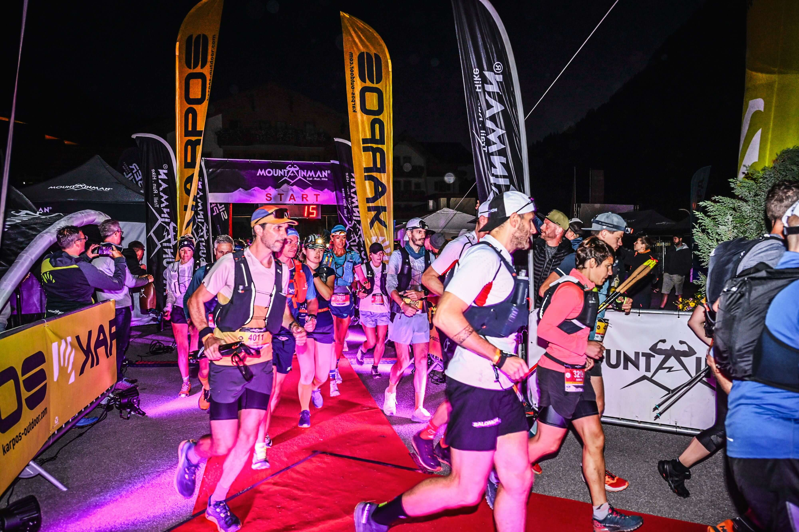
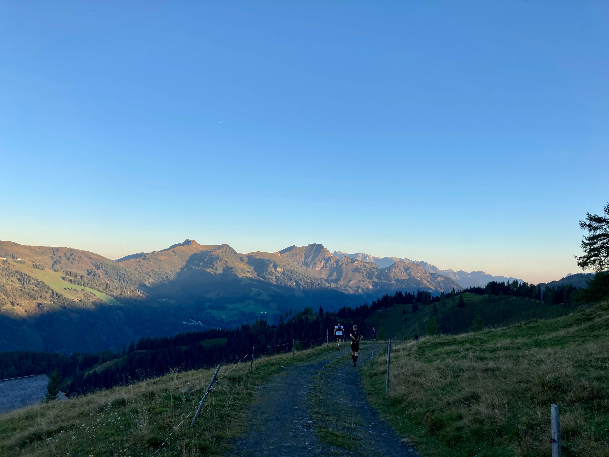
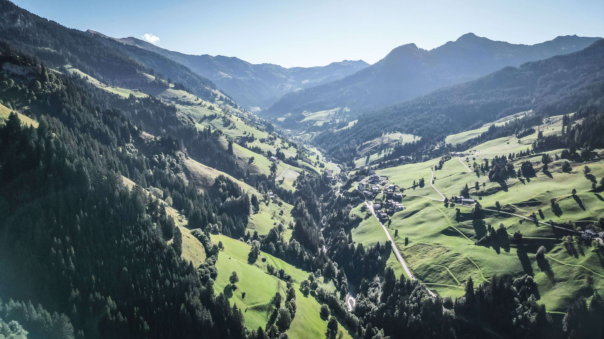
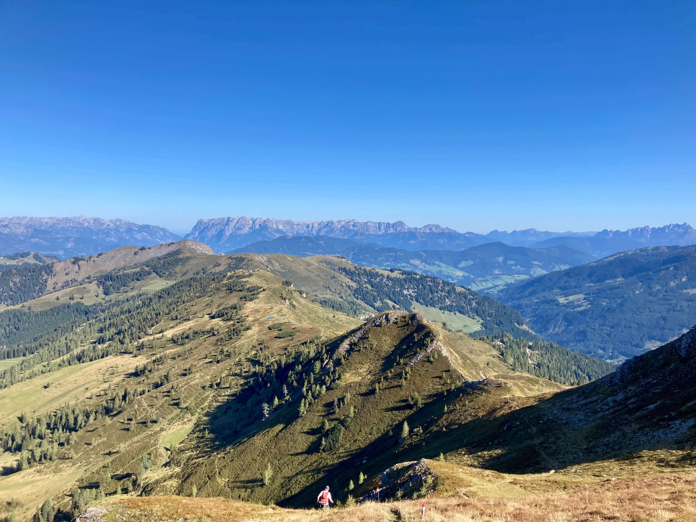
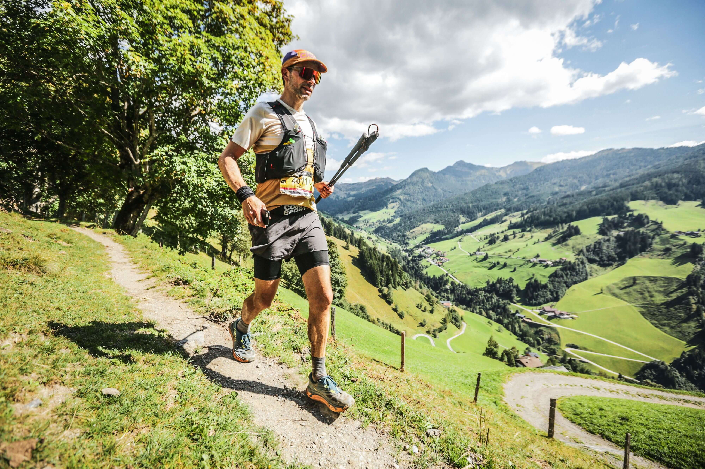
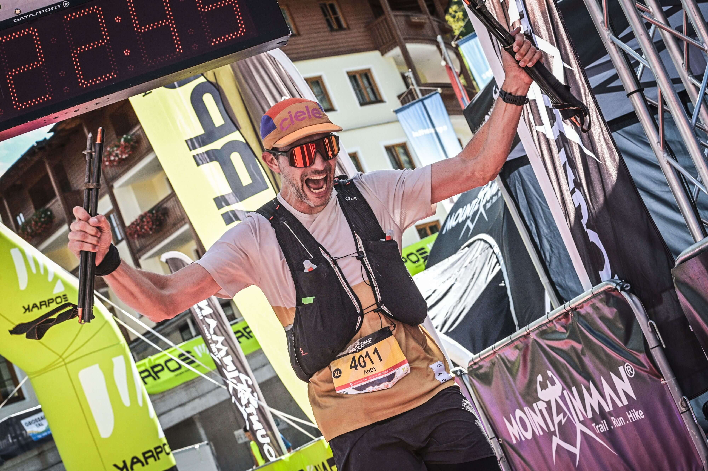

title: Mountain Man
description: Ein Ultratrail in Großarl
date: 2023-09-16
banner: "2023_MountainMan006.jpg"
tags:
  - Run
  - Österreich
  - "2023"
  - Andy
strava:
  - ["Andy" ,"https://www.strava.com/activities/9869330830"]
links:
  - ["Webseite des Veranstalters", "https://mountainman.de/"]

layout: layouts/post.njk
---

# Anreise

Ich schaue auf meine Garmin: Es ist 5:30 Uhr und ich höre die Filmmusik von „Das Boot“. Es ist noch stockdunkel. Der Himmel ist sternenklar. Ich befinde mich in einer Menschenmenge auf einem kleinen Platz im österreichischen Bergdorf Großarl. Ich sauge die ungewohnte Atmosphäre auf. Ich hätte nie gedacht, dass ich mal bei einem Trailrunning-Wettkampf inmitten von Läufern stehen werde. Der Weg hierher war lang und profiliert wie ein Trailrun selbst. Seit mittlerweile 3 Jahren laufe ich relativ intensiv und die längeren Distanzen wurden immer reizvoller.  Begonnen hat das mit der Geburt von Linus. Die Zeit wurde noch knapper und dadurch die Möglichkeit für Bikeausfahrten unwahrscheinlich. Das Laufen war da eine willkommene Ersatzdroge, die mir half viele Probleme wie die Unsicherheiten der Pandemie, die familiären Herausforderungen Zuhause oder Krankheiten im erweiterten Familienkreis zu verarbeiten. Das hatte zur Folge, dass ich selten so fit war. Auch wenn sich schon abgezeichnet hat, dass es mehr braucht als gute Beine und eine große Lunge, um längere Zeit ein Läufer zu sein. Die stetige Progression in Pace und Umfang zollten ihren Tribut und zu meinem Langzeitproblem einer chronischen Achillessehnenreizung kamen andere Dinge wie Jumpers Knee, Plantarfaszilitis und Überlastung der Peronealsehne. Trotz der körperlichen Widerstände wuchs der Wunsch, diese Ära zu krönen oder abzuschließen - wie auch immer man das nennen will. Einfach einen Marathon auf der Straße von meiner Haustür zum Starnberger See und dort dann die Familie treffen? Oder richtig mit Wettkampf gegen die Uhr und anderen beim München Marathon? Aber eigentlich hatte ich schon die meiste Freude beim Laufen auf Trails in den Bergen. Und so ergab es sich, dass Albrecht und ich uns an Weihnachten für den Mountain Man Berglauf in Großarl angemeldet haben. Albrecht entschied sich für die M-Distanz mit 17 Kilometern und ich mich für die große Runde mit 50 Kilometer. Somit noch 9 Monate zur Vorbereitung. Ich hatte mir vorgenommen, nicht die gleichen Fehler der letzten Jahre zu machen und vor allem die Trainingsintensität zu kontrollieren.
 
 
## Image grid


{{ imageGrid([
 ["2023_MountainMan000.jpg", "2023_MountainMan001.jpg"],
]) }}
 
 
Und jetzt stand ich tatsächlich an der Startlinie 9 Monate und 1100 Trainingskilometer zu Fuß später. Die Achterbahnfahrt der Vorbereitung war dank unseres Midlifethon Channels auf Slack deutlich erträglicher. Hatten sich mit Mark und Nils neben Albrecht noch ein paar Bekloppte mit Laufambitionen für 2023 gefunden. 
 
 

 
 
Ähnlich wellig wie die Vorbereitung lief auch die Anreise hierher. Ein Blechschaden in München, ein Stau auf der Autobahn, ein übertrieben langes Abendessen und eine Fiebernacht mit Linus, ein kaputter Flask und undichte Gels in der Früh sind nicht die Vorbereitung, die ich mir vorgestellt hatte. Daher kann ich auch nur wie ein Zombie antworten, das ich schlecht geschlafen habe auf die Frage eines Mitläufers in meinem Hotel, ob ich fit sei. Naja, die Panik in seinen Augen war deutlich größer. Denn eigentlich fühlte ich mich gut vorbereitet und nach den zwei Tassen Kaffee und den Overnight Oats auch halbwegs wach.

 
 

# Los geht's!

Die Zeit vor dem Start nutzte ich noch für ein paar Mobilisierungsübungen und einen Gang zur Toilette und dann kam auch schon der Countdown. Ich freute mich, dass es jetzt wirklich losgeht und das ein langer Tag vor mir lag, und das Grinsen sollte heute mein regelmäßiger Begleiter sein. Ich hatte mir vorgenommen, die ersten Kilometer langsam zu machen und meinen Sehnen Zeit zum Aufwachen zu geben und so fand ich einen Platz im vorderen Mittelfeld, als es in einer langen Schlange in den Wald ging. Der erste Aufstieg war die Himmelsleiter: ein steiler und wurzeliger Anstieg. Ich merkte schon dass meine Wohlfühlpace im unteren Herzbereich ein gutes Stück höher war als der Durchschnitt und so konnte ich direkt einige Leute einkassieren ohne das ich mich sonderlich anstrengen musste. Pünktlich zum Sonnenaufgang waren wir aus dem Wald raus und auch schon bald am ersten Verpflegungspunkt. 
 
 

 
 
Ich hatte mir fest vorgenommen viel und regelmäßig zu essen und mir sogar einen 45 Minuten Fresstimer gestellt und so gab es an der Bichlalm das erste Stück Kuchen des Tages und einen Refill für die Flaschen. Das folgende Flachstück auf dem Bergrücken machte Lust auf mehr - alles fühlte sich gut an. Leider brachte eine kurzfristige Streckenänderung zu den 5 Extrakilometern noch 400 Höhenmeter zusätzlich und vor allem einen 400 Tiefenmeter Downhill auf einer Forststrasse. 
 
 

 
 
Diese Facette hatte ich in meiner Vorbereitung schlicht ignoriert und ich merkte gleich, dass hier Vorsicht geboten war, wenn ich die Quads nicht gleich durchballern wollte. So nahm ich einige Überholungen in Kauf, freute mich dann aber doch, die meisten Leute im folgenden Anstieg dann wieder zusehen. Hier liefs wieder spitze und VP2 und 3 kamen recht zügig. Mittlerweile war es 9:00 und somit die ersten drei Stunden und 20 Kilometer im Sack. Die folgende  Isohypsige Passage auf der Höhe mitten durch Blaubeersteäucher und eingebettet in ein herrliches Panorama mit Hohen Tauern, Hochkönig und Tennengebirge war der reinste Genuss und das Runners High hätte nicht höher sein können. Genau dafür bin ich gekommen und ich genoss jeden Atemzug. Abgesehen von den Käsegnocchis vom Abendessen - die lagen mir doch recht schwer im Magen und ich rechnete eigentlich fest mit einem ungeplanten Zwischenstopp im Unterholz.
 
 
## Image grid


{{ imageGrid([
 ["2023_MountainMan004.jpg", "2023_MountainMan005.jpg"],
]) }}
 
 
Eingebettet in eine Vierergruppe war ich ziemlich im Flow, als ich an einer Geländebarriere realisierte, dass die Streckenmarkierung für den XL-Trail fehlte. Tatsächlich bin ich geistesabwesend an einem riesigen Hinweis zur Streckenteilung von L- und XL-Trail vorbeigelaufen und musste jetzt eine kleine Ehrenrunde drehen. Glücklicherweise war es vermutlich nicht mehr als 1 Kilometer, für den Kopf allerdings ein Warnhinweis, achtsam zu sein. Wieder auf dem Track freute ich mich mittlerweile richtig Hoch zu sein und nur noch wenige Läufer waren mit mir unterwegs.
 
 
## Image grid


{{ imageGrid([
 ["2023_MountainMan007.jpg", "2023_MountainMan009.jpg"],
]) }}
 
 

# Runners High

Am Gipfel des Gründeggs auf 2100 m überholte ich zum ersten Mal Hans, der mich die folgenden Kilometer bis ins Ziel begleiten sollte. Immer wieder wurden wir von Wanderern, den Leuten an den Labestationen, Bergrettlern oder Leuten, die gezielt auf die Läufer warteten, gefeiert - die Stimmung und das Ambiente war fantastisch. Der folgende Downhill zur Kleinarler Hütte bei K30 war ein besonderes Highlight. Erst abfallend am Grat entlang, dann steiler und technisch werdender war es die reinste Freude. Ich spürte zwar immer wieder, dass ich auf meinen verletzten Knöchel noch Acht geben muss, aber bisher gelang mir das ganz gut.
 
 
## Image grid


{{ imageGrid([
 ["2023_MountainMan010.jpg", "2023_MountainMan011.jpg"],
 ["2023_MountainMan012.jpg", "2023_MountainMan013.jpg"],
]) }}
 
 
Generell fühlte ich mich sehr gut und hatte den Eindruck, die Belastung gut unter Kontrolle zu haben. Ich aß regelmäßig, wenn auch jedes Gel weniger gut rein ging. Aber die Strategie, vor allem auf meine eigene Auswahl an Verpflegung zu setzen, ging gut auf - an den Labestationen nahm ich vor allem Flüssigkeit mit und pickte nur hier und da ein Stückchen Kuchen oder etwas Obst.
 
 

# Mittelstück

Im folgenden gingen es wieder hoch auf den Bergrücken und da weiter isohypsig auf wunderbaren singletrails. Ich hatte das Gefühl für immer so weiterlaufen zu können. Es war anstrengend, aber ich zwang mich nie in den roten Bereich. Immer wieder rief mir Hans von hinten etwas zu. Vielleicht wollte er mich nur wissen lassen, dass er noch an mir dran ist, aber ich freute mich jedes Mal. Hin und wieder plauderten wir etwas und so erfuhr ich, dass er Jahrgang 71 war, aus dem Burgenland kam und dieses Jahr schon den Mozart 100 Kilometer Trailrun mitgemacht hat. Ich glaube, die Tatsache, dass ich zum einen jünger und dann auch noch Deutscher war, motivierte ihn. 
 
 
## Image grid


{{ imageGrid([
 ["2023_MountainMan015.jpg", "2023_MountainMan016.jpg"],
]) }}
 
 
Die Kilometer 30 - 38 verliefen unspektakulär schön und rollten dahin durch die schönste Landschaft. Erst der nächste VP brachte dann einen längeren Anstieg auf einer Schotterstraße mit sich. Hier fühlte ich mich das erste Mal richtig angestrengt. Hans überholte mich als ich gehen musste und feuerte mich im Laufschritt an mit zu ziehen aber in dem Moment war mir das zu viele und ich dachte, jetzt kommt die Pain Cave und ich gönnte mir ein paar weitere Schritte im Gehen und ließ Hans ziehen mit dem Gedanken ihn wohl erst im Ziel wieder zu sehen. 
 
 

 
 
Tatsächlich tat mir die kleine „Pause“ aber sehr gut und ich fand relativ bald wieder meinen Lauftritt und als ich von der Schotterpiste auf den abwechslungsreichen Singletrail wechselte, kam auch das Grinsen zurück. Ich hatte wieder das Gefühl, leichtfüßig zu sein, ohne dass mein Puls übermäßig hoch ging. Und auf einmal tauchte auch Hans wieder auf, der jetzt in dem technischeren Gelände sichtlich Probleme hatte und ich glaube, er freute sich auch, als ich wieder die Führung übernahm und er meiner Linie folgen konnte. Kurz darauf hörte ich ihn sagen: „Marathon haben wir jetzt schon!“ „Dann bringen wir das Ding jetzt nach Hause!“ war meine Antwort. Ich denke die folgenden 10 Kilometer waren meine stärksten im ganzen Rennen. Ich war topmotiviert, die Beine wieder da und das Ziel kam näher. 
 
 
## Image grid


{{ imageGrid([
 ["2023_MountainMan017.jpg", "2023_MountainMan019.jpg"],
]) }}
 
 

# Endspurt

Als sich vor uns ein Hang auftat, waren mit einem Mal noch 4 weitere Läufer zu sehen. Zwei von ihnen sah man die Anstrengung deutlich an. „Die nehm ich noch mit“, war mein Ansporn. Es dauerte auch nicht lange, bis ich drei von ihnen hinter mir ließ und dem 4 auf den Fersen war und als er kurz die Orientierung verlor, war ich auch vor ihm. Es lief wirklich gut. Witzigerweise meldete sich auch Hans immer wieder und ließ mich wissen, dass er noch da ist. Das freute und motivierte mich. Zu dritt kamen wir bei der letzten Labestation an. Für mich gab es neben den neuen Getränken für die Flasks nur etwas Melone und Orange. Ansonsten war ich unruhig und wollte weiter. Hans plauderte munter mit der Hüttenwirtin und ich verabschiedete mich mit meinem obligatorischen: „Hans, wir sehen uns gleich…“ Hier hatten wir die 50 Kilometer schon geknackt und ich fühlte mich immer noch gut auf dem kurzen Flachstück. Ich freute mich jetzt nur noch bergab ins Ziel zu rollen. Kurz darauf meldeten sich allerdings meine Oberschenkel aufgrund des steilen Schotterweges, der nun vor mir lag. Ich hörte Hans hinter mir: „Andy! Was ist los?“ „Bah! Ist das steil!“ war meine Antwort. 
 
 

 
 
Und tatsächlich konnte ich nicht mehr folgen, als Hans und Christoph mich einholten und vorbeizogen. Die letzten Kilometer waren gnadenlos! In der Steilheit und der Monotonie. Das war der mit Abstand härteste Moment des Tages. Nicht die Lunge, nicht der Kopf, nicht die Sehnen oder fehlende Energie: Es war die stumpfe muskuläre Belastung bergab. Umso mehr freute ich mich, als ich erst Albrecht und dann den Rest der Gang realisierte. Die Kinder hüpften begeistert auf und ab und kamen auf mich zu gerannt und jubelten. Albrecht gab mir mit, dass die beiden vor mir nur wenige Minuten voraus sind. Linus gab mir einen Stock mit und Franzi ein Bussi für die letzten Meter. Albrecht begleitete mich noch, bis er wieder in einen Trail ging und verließ mich mit den Worten: “Wir sehen uns gleich beim Zieleinlauf!” Das gab mir dann nochmal einen Push und ich wollte das Ding mit Spaß und Freude zu Ende bringen. Vor allem das letzte Stück durchs Dorf war nochmal richtig schön und meine Beine fühlten sich wieder gut an. Auf den letzten Metern bis zum Zielkanal begleitete Albrecht mich dann nochmal und der Moment, als ich den Sprecher meinen Namen sagen hörte und meine jubelnde Familie sah, war wirklich sehr schön und bewegend. Das Ziel einer Reise. 
 
 

 
 

Auch Hans war gleich da und blubberte mich voll und freute sich über den Sieg in seiner Altersklasse. Albrecht wollte gleich Bier trinken. Die Kinder quakten mich fröhlich voll. Aber das war mir in dem Moment alles etwas zu viel und ich brauchte etwas Zeit zum Wieder Ankommen.
 
 

# Fazit

Ca. 40 Minuten später stehe ich bis zu den Knien in eiskaltem Wasser des Bachlaufs auf RuckiZuckis Gaudispielplatz. Ich fühle mich gut und freu mich mittlerweile auf einen Drink. Jetzt aber erstmal duschen, nachdem ich ausgiebig mit den Kindern gespielt habe. Linus ist halbwegs fit - im Lauf der Woche wird sich herausstellen, dass er sich wohl im Kindergarten mit Corona angesteckt hat und am folgenden Wochenende die ganze Familie krank zu Hause sein wird. Ähnlich wie in Heidelberg, wo ein anderes großes Event eigentlich hätte stattfinden sollen. Mein Muskelkater wird nach 3 Tagen abgeklungen sein und meine Gedanken setzen sich etwas. Noch am Abend des Laufes habe ich mit Albrecht beim Bier schon wieder über neue Projekte gesprochen und auch die Tage danach finde ich mich immer wieder auf Webseiten von Ultra Trail Rennen wie z.B. den Eiger Ultra, dem Lavaredo oder Ultraks in Mayrhofen. Mich beschleicht das Gefühl, dass diese Reise für mich noch nicht abgeschlossen ist. Ich habe mir fest vorgenommen, erstmal meine Blessuren auszukurieren. Ende des Jahres wartet eine MRT, um mir den aktuellen Stand zu geben, bis dahin will ich es langsam angehen. Eigentlich. Denn eigentlich bin ich schon 3 Tage nach dem Lauf unruhig und will wieder die Beine bewegen. Irgendwie gut, dass Corona mich ausbremst. 
 
 
## Image grid


{{ imageGrid([
 ["2023_MountainMan022.jpg", "2023_MountainMan023.jpg"],
]) }}
 
 

Rückblickend denke ich, es wären auch mehr als 55 Kilometer und 3000 Höhenmeter möglich gewesen. Ich hätte schneller sein und mehr laufen können. Ich hätte vermutlich nicht bei jedem Verpflegungspunkt anhalten müssen. Ich hätte gern mehr auf Trails trainiert und wäre gern mehr Longruns in den Bergen gelaufen. Ich wäre gern ausgeschlafen in das Rennen gestartet. Die Achillessehne und die Peronealsehne haben mein Training schon stark beeinflusst - ich bin weniger Tempoeinheiten und weniger Trails gelaufen, um die Belastung gering zu halten - wie wäre es wohl anders gewesen. Die Frage kommt immer wieder auf. Aber jedes Mal komme ich zum Schluss, dass ich eigentlich nicht glücklicher sein könnte. 
 
Ich hatte einen fantastischen Tag. Ich konnte das ganze Rennen genießen und hatte alles, was ich mir von einem langen Trail gewünscht habe. Ich konnte den Tag mit Freunden und meiner Familie teilen. Ich bin sehr glücklich, diesen Tag in meinem Depot zu haben.

## Images

## Komoot Embedding

<iframe src="https://www.komoot.de/tour/1303846324/embed?profile=1&share_token=aV3VKb3UNLMoExMaHiq3orhkO7Zx1eQJZhN8dbDQ8XhPKRnQdK" width="100%" height="700" frameborder="0" scrolling="no"></iframe>